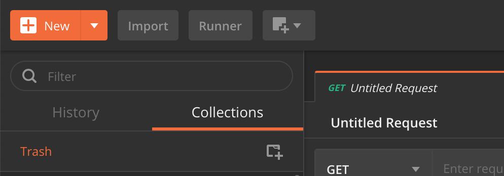
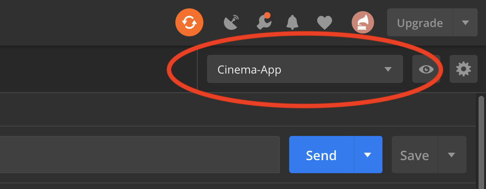
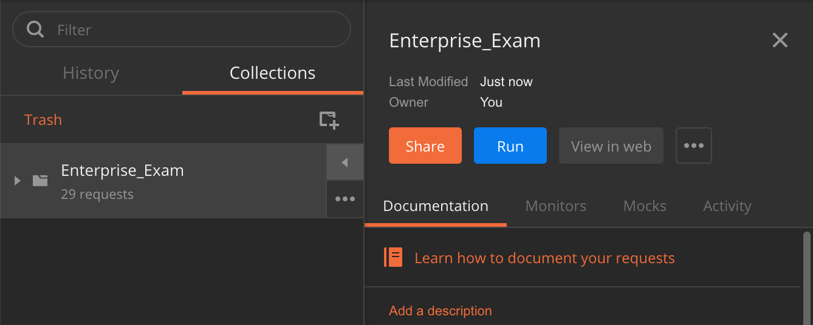
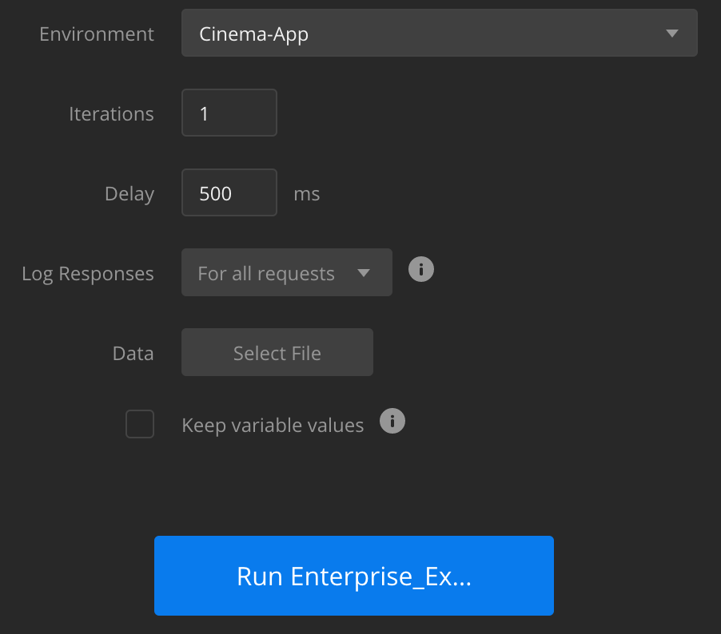

[Back to README](../README.md)

## Content of default data
[See this document](defaultdataContent.md)

## Instructions on how to import Default data
To import this default data you need to have Postman installed on your computer.  
Postman is a free and powerful application for Mac, Windows and Linux that lets a user do HTTP-requests directly from your computer.  
In addition to make HTTP requests the user can also make environments and save global settings and variables to be reused in later request. 
That is what we have done for adding default data in this exam.

[Get Postman here](https://www.getpostman.com/apps)

## How to import the default data into Postman
1. In the rootfolder of this project there are two files:
    - **Cinema-App.postman_environment.json**  
    This is a Postman Environment file that contains global variables for storing the different IDs for the data that is to be added 
    - **Enterprise_Exam.postman_collection.json**  
    This is a file that contains all the POST requests that are necessary to import all the defined predefined data
2. Open postman and push the import button in the top left corner  
    
3. Import both **Cinema-App.postman_environment.json** and **Enterprise_Exam.postman_collection.json**.
4. After this is done you need to select the imported Environment  
    
5. You also have a new Collection on the left side of the window. Press the **"Play"**-button  when you hover over this button. An press **Run**  
    
6. Now a new **Collection-runner**-window should appear.  
    Make sure these fields have the following values:
    - Environment: "Cinema-App"
    - Iterations: 1
    - Delay: 500 ms (For safety because of async tasks)  
    And hit **Run** and wat for it to finish
    
    
7. Now all the data is getting sent and stored in the applications Database.
    